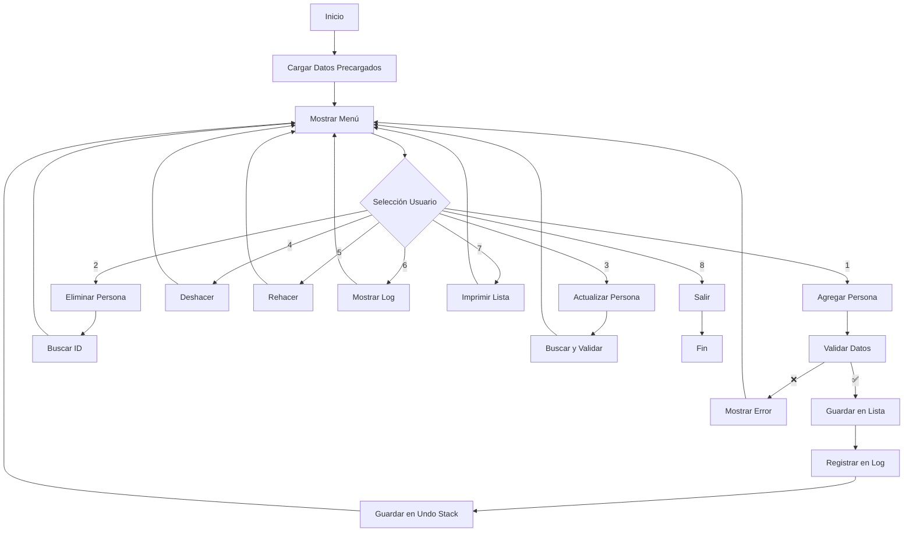
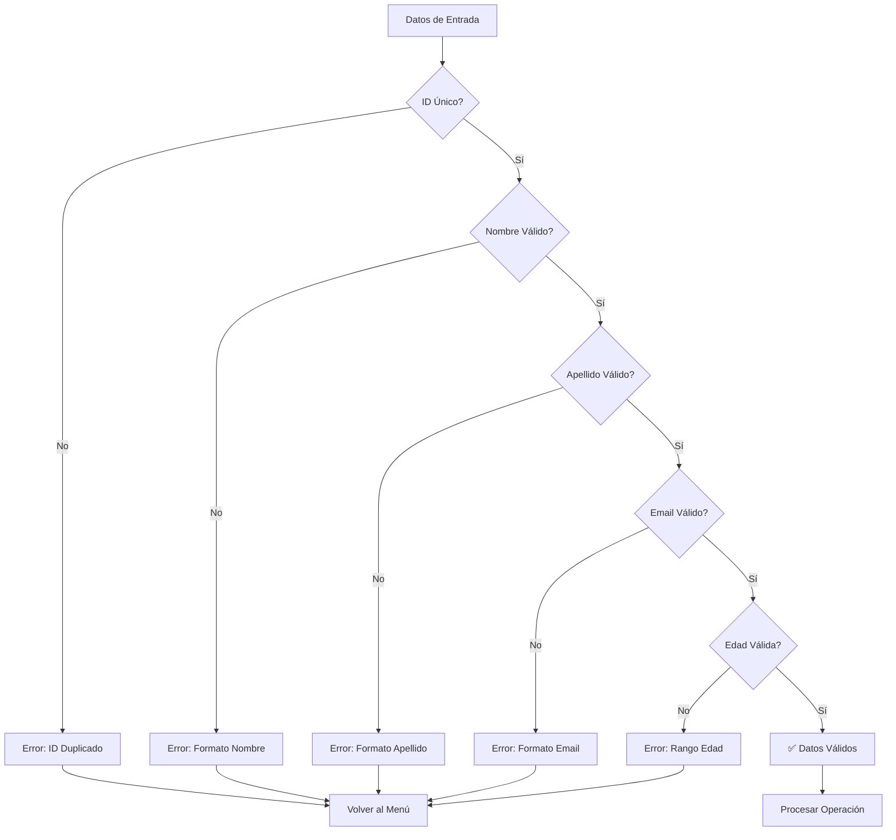
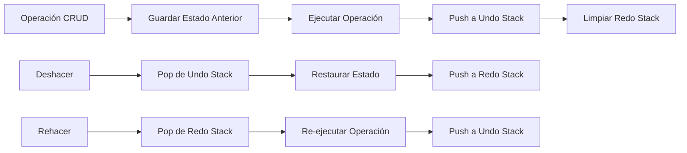

# 🏢 Sistema CRUD+ Personas
# eeeeeee


Un sistema de gestión de personas desarrollado en Java con funcionalidades CRUD completas, deshacer/rehacer, logs de transacciones y validaciones robustas.

## 📋 Tabla de Contenidos

- [Características](#-características)
- [Arquitectura del Proyecto](#-arquitectura-del-proyecto)
- [Requisitos](#-requisitos)
- [Instalación y Ejecución](#-instalación-y-ejecución)
- [Manual de Usuario](#-manual-de-usuario)
- [Estructuras de Datos](#-estructuras-de-datos)
- [Validaciones](#-validaciones)
- [Sistema de Logs](#-sistema-de-logs)
- [Ejemplos de Uso](#-ejemplos-de-uso)
- [Flujo de Operaciones](#-flujo-de-operaciones)
- [Contribución](#-contribución)

## 🚀 Características

### ✨ Funcionalidades Principales

- **CRUD Completo**: Crear, Leer, Actualizar y Eliminar personas
- **Deshacer/Rehacer**: Sistema completo de undo/redo para todas las operaciones
- **Validaciones Robustas**: Validación de datos de entrada (nombres, emails, edades, IDs únicos)
- **Log de Transacciones**: Registro detallado de todas las operaciones con timestamps
- **Datos Precargados**: 5 personas de ejemplo cargadas automáticamente
- **Interfaz de Consola**: Menú interactivo fácil de usar

### 🛡️ Validaciones Incluidas

- ✅ **IDs únicos**: No permite duplicados
- ✅ **Nombres y apellidos**: Solo letras, acentos y caracteres especiales
- ✅ **Email**: Validación de formato con regex
- ✅ **Edad**: Rango válido (0-120 años)
- ✅ **Campos obligatorios**: No permite campos vacíos

## 🏗️ Arquitectura del Proyecto

```text
src/gestionPersonas/
├── app/
│   └── Main.java                 # Punto de entrada y interfaz de usuario
├── data/
│   ├── Lista.java               # Estructura de lista enlazada
│   ├── Log.java                 # Sistema de logs
│   └── Pila.java                # Estructura de pila para undo/redo
├── model/
│   ├── Accion.java              # Modelo para acciones de undo/redo
│   └── Persona.java             # Modelo de datos de persona
└── service/
    └── CrudService.java         # Lógica de negocio y operaciones CRUD
```

### 📐 Patrón Arquitectónico

- **MVC (Model-View-Controller)**: Separación clara de responsabilidades
- **Capas**: Presentación, Servicio, Datos y Modelo
- **Encapsulación**: Cada clase tiene responsabilidades específicas

## 🔧 Requisitos

- **Java**: JDK 11 o superior
- **Sistema Operativo**: Windows, Linux, macOS
- **Memoria**: Mínimo 512MB RAM
- **IDE Recomendado**: VS Code, IntelliJ IDEA, Eclipse

## 🚀 Instalación y Ejecución

### 1. Clonar el Repositorio
```bash
git clone https://github.com/Re-L77/CRUD_EDD.git
cd CRUD_EDD
```

### 2. Compilar el Proyecto
```bash
# Crear directorio de clases compiladas
mkdir -p bin

# Compilar todas las clases
javac -d bin src/gestionPersonas/**/*.java
```

### 3. Ejecutar la Aplicación
```bash
java -cp bin gestionPersonas.app.Main
```

### 4. Ejecutar desde VS Code
- Abrir el proyecto en VS Code
- Presionar `Ctrl+F5` o usar "Run Without Debugging"
- O hacer clic derecho en `Main.java` → "Run Java"

## 👥 Manual de Usuario

### 🎯 Menú Principal

```text
Menú Principal ---- PERSONAS ----
[1] Agregar       # Agregar nueva persona
[2] Eliminar      # Eliminar persona por ID
[3] Actualizar    # Modificar datos de persona existente
[4] Deshacer      # Revertir última operación
[5] Rehacer       # Restaurar operación deshecha
[6] Log           # Ver historial de transacciones
[7] Imprimir      # Mostrar todas las personas
[8] Salir         # Cerrar aplicación
```

### 📝 Datos Precargados
Al iniciar la aplicación, se cargan automáticamente 5 personas:
1. **Juan Pérez** (25 años) - juan.perez@email.com
2. **María García** (30 años) - maria.garcia@email.com
3. **Carlos López** (28 años) - carlos.lopez@email.com
4. **Ana Martín** (35 años) - ana.martin@email.com
5. **Luis Rodríguez** (42 años) - luis.rodriguez@email.com

### 🔢 Formato de Datos
- **ID**: Número entero único
- **Nombre**: Solo letras y acentos (ej: "María José")
- **Apellido**: Solo letras y acentos (ej: "García-López")
- **Edad**: 0-120 años
- **Email**: Formato válido (ej: "usuario@dominio.com")

## 📊 Estructuras de Datos

### 🔗 Lista Enlazada (`Lista.java`)
- **Implementación**: Lista enlazada simple
- **Operaciones**: Agregar, eliminar, buscar, reemplazar
- **Complejidad**: O(n) para búsquedas, O(1) para inserción al inicio

### 📚 Pila (`Pila.java`)
- **Uso**: Implementa undo/redo stack
- **Operaciones**: Push, pop, isEmpty
- **Principio**: LIFO (Last In, First Out)

### 📋 Log (`Log.java`)
- **Función**: Registro de transacciones
- **Formato**: "timestamp operacion id"
- **Persistencia**: En memoria durante la sesión

### 🎬 Acción (`Accion.java`)
- **Propósito**: Encapsula operaciones para undo/redo
- **Atributos**: tipo, personaAnterior, personaNueva, timestamp

## 🛡️ Validaciones

### ✅ Validación de Texto (Nombres/Apellidos)
```java
// ✅ Válido
"Juan", "María José", "García-López", "O'Connor"

// ❌ Inválido
"Juan123", "", "María@", "José#García"
```

### ✅ Validación de Email
```java
// ✅ Válido
"usuario@dominio.com", "test.email@universidad.edu.mx"

// ❌ Inválido
"email_sin_arroba", "@dominio.com", "usuario@"
```

### ✅ Validación de Edad
```java
// ✅ Válido
0, 18, 65, 120

// ❌ Inválido
-5, 150, 999
```

### ✅ Validación de ID Único
```java
// ✅ Válido: ID no existe
ID: 10 (si no está en uso)

// ❌ Inválido: ID duplicado
ID: 1 (si ya existe una persona con ID 1)
```

## 📊 Sistema de Logs

### 📝 Tipos de Operaciones Registradas
- `alta [ID]` - Persona agregada
- `baja [ID]` - Persona eliminada  
- `modif [ID]` - Persona modificada
- `deshacer_alta [ID]` - Adición deshecha
- `deshacer_baja [ID]` - Eliminación deshecha
- `deshacer_modif [ID]` - Modificación deshecha
- `rehacer_alta [ID]` - Adición rehecha
- `rehacer_baja [ID]` - Eliminación rehecha
- `rehacer_modif [ID]` - Modificación rehecha

### 📅 Formato de Timestamp
```
25 November 2025, 14:30:45 alta 1
25 November 2025, 14:31:12 modif 1
25 November 2025, 14:31:28 deshacer_modif 1
```

## 💡 Ejemplos de Uso

### 🆕 Agregar Persona
```
Seleccione una opción: 1
ID: 6
Nombre: Pedro
Apellido: Sánchez
Edad: 28
Email: pedro@email.com

✅ Resultado: "Persona agregada con éxito: Pedro Sánchez"
```

### ✏️ Actualizar Persona
```
Seleccione una opción: 3
ID: 1

Persona encontrada: [1, Juan, Pérez, 25, juan.perez@email.com]
Nuevo nombre: Juan Carlos
Nuevo apellido: Pérez
Nueva edad: 26
Nuevo email: juancarlos@email.com

✅ Resultado: "Persona actualizada correctamente."
```

### 🔄 Deshacer/Rehacer
```
Seleccione una opción: 4
✅ Resultado: "Se deshizo: modificación = valores anteriores restaurados"

Seleccione una opción: 5
✅ Resultado: "Rehecha acción (MODIF): Re-aplicada modificación en Persona ID 1"
```

## 🔄 Flujo de Operaciones

### 📊 Diagrama de Flujo Principal



### 🔧 Flujo de Validaciones



### 🔄 Sistema Undo/Redo



## 🎯 Casos de Uso

### 👤 Administrador del Sistema
- Gestiona la lista de personas
- Consulta logs para auditoría
- Deshace operaciones erróneas
- Mantiene datos actualizados

### 📊 Analista de Datos
- Revisa logs de transacciones
- Analiza patrones de uso
- Verifica integridad de datos

### 🧪 Tester/QA
- Valida todas las funcionalidades
- Prueba casos edge
- Verifica validaciones
- Confirma flujos de undo/redo

## 🚨 Manejo de Errores

### 🔍 Tipos de Errores Manejados

| Error | Descripción | Acción |
|-------|-------------|---------|
| ID Duplicado | Intento de agregar ID existente | Mostrar error, solicitar nuevo ID |
| Formato Email | Email con formato inválido | Mostrar error, solicitar formato correcto |
| Edad Fuera de Rango | Edad < 0 o > 120 | Mostrar error, solicitar edad válida |
| Nombres con Números | Nombres/apellidos con dígitos | Mostrar error, solicitar solo letras |
| ID No Existe | Intento de modificar/eliminar ID inexistente | Mostrar error, listar IDs válidos |
| Stack Vacío | Intento de undo/redo sin operaciones | Mostrar "No hay acciones para..." |

## 🔒 Limitaciones Conocidas

- **Persistencia**: Los datos no se guardan en disco (solo en memoria)
- **Concurrencia**: No está diseñado para múltiples usuarios simultáneos  
- **Capacidad**: Limitado por la memoria disponible del sistema
- **Interfaz**: Solo interfaz de consola (no GUI)


## 👨‍💻 Autor

**Re-L77**
- GitHub: [@Re-L77](https://github.com/Re-L77)
- Proyecto: [CRUD_EDD](https://github.com/Re-L77/CRUD_EDD)

---


<div align="center">

**⭐ ¡Si te gusta este proyecto, dale una estrella! ⭐**

Hecho con ❤️ en Java

</div>
